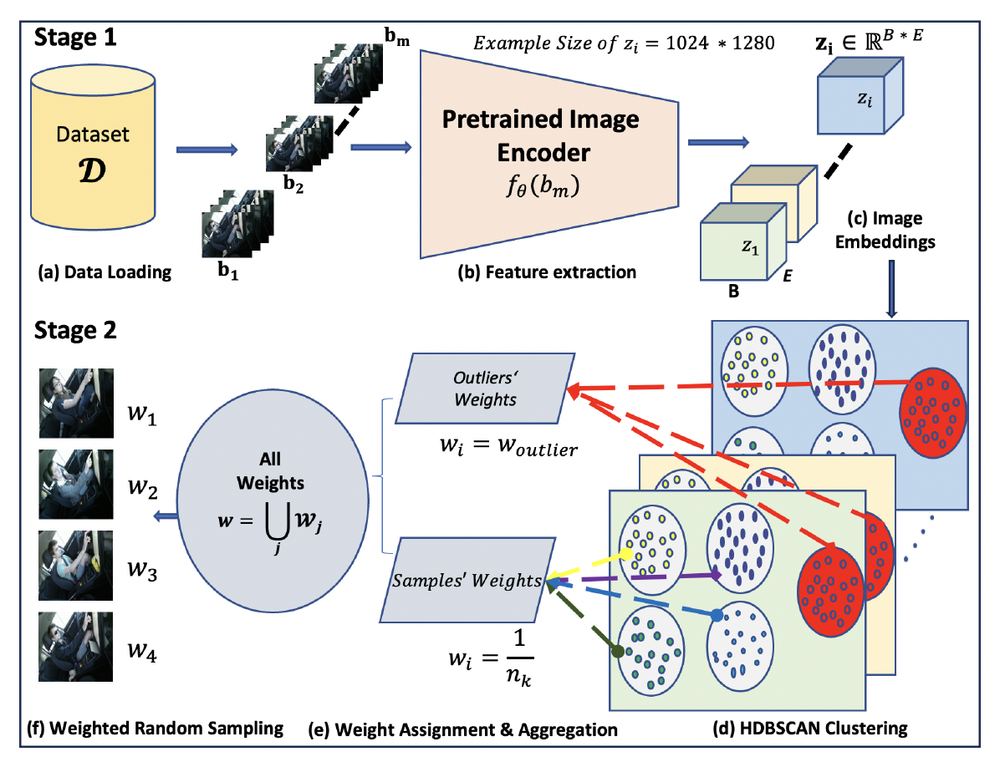

# Self-Supervised Driver Distraction Detection for Imbalanced Datasets
**Accepted at:** IEEE International Conference on Intelligent Transportation Systems (ITSC), 2025 

---

## Overview

Driver distraction is a major contributor to road traffic accidents worldwide.   Real-world driving datasets are inherently **long-tailed and imbalanced**, making robust distraction detection particularly challenging.

This work introduces **Clustered Feature Weighting (CFW)**, a
**label-free sampling strategy** that leverages the geometric structure
of learned feature embeddings to improve batch-level class balance and
model robustness.

## Method: Clustered Feature Weighting (CFW)

CFW transforms unsupervised structure in embedding space into training
weights.
1.  Extract feature embeddings using a pretrained backbone (ViT /
    DINOv2 based ViT).
2.  Perform batch-wise HDBSCAN clustering in embedding space.
3.  Convert cluster density statistics into per-sample weights.
4.  Train with weighted random sampling using CFW-derived weights.

<p align="center">
  
</p>


---

## Experimental Findings

- Self-supervised learning significantly improves adaptability under distribution shift.
- CFW improves **intra-batch class balance** without using label priors.
- The method enhances **accuracy, robustness, and generalization** in imbalanced scenarios.
- SSL + CFW yields the most stable performance under long-tailed distributions.

---

## Why This Matters

Most imbalance mitigation techniques rely on:

- Explicit class frequency statistics  
- Oversampling minority labels  
- Static loss reweighting  

CFW instead exploits the **geometric structure of learned representations**, enabling:

- Label-free imbalance mitigation  
- Better adaptability to unlabeled or semi-supervised settings  
- Improved robustness under distribution shift  

This makes CFW particularly suitable for real-world driving datasets where annotations may be incomplete or noisy.

---

## Reproducibility Roadmap

For a full reproduction run, use this order:

1. Create conda virtual environments.
2. Set runtime path environment variables (optional).
3. Download and build datasets (Stages A-E) and perform EDA.
4. Extract features and run feature/variance analysis.
5. Compare dataloaders.
6. Run vanilla grid search or BOHB with Ray on ViT-based or DINOv2-based encoders.
7. Train/evaluate baseline and CFW models, including cross-modality and cross-view generalization on Drive&Act.
8. Run Azure ML jobs for these steps if executing on Azure cloud (optional).

---

## 1) Environment Setup

Clone and enter the repository:

```bash
git clone git@github.com:SurajBhar/cfw.git
cd cfw
```

### Option A: Local / On-Prem

```bash
# DINOv2 environment
conda env create -f envs/environment_dinov2.yml
conda activate cfw_dinov2
pip install -e ".[azure,bayesian,dev]"

# ViT environment
conda env create -f envs/environment_vitrans.yml
conda activate cfw_vitrans
pip install -e ".[azure,bayesian,dev]"
```

### Option B: Azure-Aligned Environments

```bash
# DINOv2 Azure env
conda env create -f azureml/environments/conda_dinov2_azure.yml
conda activate cfw_dinov2_azure
pip install -e ".[azure,bayesian,dev]"

# ViT Azure env
conda env create -f azureml/environments/conda_vitrans_azure.yml
conda activate cfw_vitrans_azure
pip install -e ".[azure,bayesian,dev]"
```

## 2) Runtime Path Environment Variables (Optional)

The project does not auto-load `.env` files. Source explicitly in each shell:

```bash
cat > .env.compute << 'ENV'
CFW_DRIVEACT_BINARY_SPLIT0_DIR=./data/processed/daa_binary_kinect_color/split_0
CFW_DRIVEACT_MULTICLASS_SPLIT0_DIR=./data/processed/daa_multiclass_kinect_color/split_0
CFW_STATEFARM_BINARY_DIR=./data/processed/statefarm_balanced_binary
CFW_STATEFARM_MULTICLASS_DIR=./data/processed/statefarm_balanced_multiclass
CFW_CFW_FEATURE_SPLIT0_DIR=./outputs/features_driveact_binary/features/train
CFW_CFW_MULTICLASS_FEATURE_SPLIT0_DIR=./outputs/features_driveact_multiclass/features/train
ENV

set -a
source .env.compute
set +a
```

## 3) Data Download and Dataset Generation (Stages A-E)

### 3.1 Full Ingestion Pipeline (Optional)

```bash
python scripts/data_ingestion/run_full_pipeline.py
```

### 3.2 Stage-by-Stage Execution

```bash
# A) Download raw data
python scripts/data_ingestion/download_data.py

# B) Build Drive&Act multiclass frame datasets
python scripts/data_ingestion/build_daa_dataset.py

# C) Derive Drive&Act binary datasets
python scripts/data_ingestion/derive_binary.py

# D) Build StateFarm balanced/imbalanced variants
python scripts/data_ingestion/build_statefarm.py

# E) Generate EDA reports
python scripts/data_ingestion/generate_eda.py
```

### 3.3 Useful Optional Ingestion Overrides

Drive&Act-only download (skip StateFarm and extra modalities):

```bash
python scripts/data_ingestion/download_data.py \
  statefarm.enabled=false \
  driveact.components.kinect_ir.enabled=false \
  driveact.components.nir_right_top.enabled=false \
  driveact.components.nir_front.enabled=false

# Generating only the Drive & Act Kinect Color dataset for split 0, Kinect IR Test Set, NIR Right Top and Front Top  for Cross-modality and cross-view generalisation evaluation
python scripts/data_ingestion/build_daa_dataset.py \
  'ingestion.input.annotations_dir=./data/raw/driveandact/iccv_activities_3s/activities_3s' \
  'ingestion.splits.0.enabled=true' \
  'ingestion.splits.1.enabled=false' \
  'ingestion.splits.2.enabled=false' \
  'ingestion.camera_views.kinect_color.enabled=true' \
  'ingestion.camera_views.kinect_color.extract_splits=[train,val,test]' \
  'ingestion.camera_views.kinect_ir.enabled=true' \
  'ingestion.camera_views.kinect_ir.extract_splits=[test]' \
  'ingestion.camera_views.nir_right_top.enabled=true' \
  'ingestion.camera_views.nir_right_top.extract_splits=[test]' \
  'ingestion.camera_views.nir_front.enabled=true' \
  'ingestion.camera_views.nir_front.extract_splits=[test]'
```

Fast EDA pass:

```bash
python scripts/data_ingestion/generate_eda.py \
  processing.max_workers=4 \
  integrity.enabled=false \
  integrity.check_image_files=false

# Note : If your config is _global_, use the same command but remove ingestion. prefix from each override.
# Generate EDA only for Statefarm Imbalanced dataset:

python scripts/data_ingestion/generate_eda.py \
  'ingestion.datasets.daa_multiclass_kinect_color.enabled=false' \
  'ingestion.datasets.daa_binary_kinect_color.enabled=false' \
  'ingestion.datasets.daa_multiclass_kinect_ir.enabled=false' \
  'ingestion.datasets.daa_binary_kinect_ir.enabled=false' \
  'ingestion.datasets.daa_multiclass_nir_right_top.enabled=false' \
  'ingestion.datasets.daa_binary_nir_right_top.enabled=false' \
  'ingestion.datasets.daa_multiclass_nir_front.enabled=false' \
  'ingestion.datasets.daa_binary_nir_front.enabled=false' \
  'ingestion.datasets.statefarm_balanced_multiclass.enabled=false' \
  'ingestion.datasets.statefarm_balanced_binary.enabled=false' \
  'ingestion.datasets.statefarm_imbalanced_multiclass.enabled=true' \
  'ingestion.datasets.statefarm_imbalanced_binary.enabled=false' \
  'ingestion.processing.max_workers=4' \
  'ingestion.integrity.enabled=false'
```

### 3.4 Smoke Dataset Generation (Optional)

StateFarm smoke pool and splits:

```bash
python scripts/smoke/make_statefarm_smoke_pool.py \
  --source-pool data/raw/statefarm_pool \
  --dest-pool data/raw/statefarm_pool_smoke \
  --per-class 80 \
  --seed 42 \
  --clear-dest

python scripts/data_ingestion/build_statefarm.py \
  --config-name ingestion/statefarm_splits_smoke
```

Enable imbalanced smoke variants:

```bash
python scripts/data_ingestion/build_statefarm.py \
  --config-name ingestion/statefarm_splits_smoke \
  ingestion.variants.imbalanced_multiclass.enabled=true \
  ingestion.variants.imbalanced_binary.enabled=true
```

Drive&Act smoke CSV generation:

```bash
python scripts/smoke/make_driveact_smoke_csv.py \
  --source-dir data/raw/driveandact/iccv_activities_3s/kinect_color \
  --dest-dir data/raw/driveandact/iccv_activities_3s_smoke/kinect_color \
  --split-id 0 \
  --train-cap 120 --val-cap 40 --test-cap 40 \
  --shuffle --ensure-class-coverage
```

---

## 4) Feature Extraction and Feature/Variance Analysis

CFW requires pre-extracted features for the training split.

Important: keep extraction settings aligned with training (`dataloader.batch_size`, `feature_extraction.shuffle`, `feature_extraction.drop_last`) due to the coupled-batch metadata contract.

### 4.1 Canonical Example (Drive&Act Binary)

```bash
python scripts/extract_features.py \
  experiment=cfw_dinov2_binary \
  +split=train \
  +output_dir=./outputs/features_driveact_binary
```

Output files under `./outputs/features_driveact_binary/features/train/`:
- `features.pkl`
- `labels.pkl`
- `image_paths.pkl`
- `feature_extraction_metadata.json`
- `feature_metrics.json`

### 4.2 Recommended Robust Analysis Settings

```bash
python scripts/extract_features.py \
  experiment=cfw_dinov2_binary \
  +split=train \
  +output_dir=./outputs/features_driveact_binary \
  feature_analysis.normalize=l2 \
  feature_analysis.nearest_centroid_mode=holdout \
  feature_analysis.nearest_centroid_metric=cosine \
  feature_analysis.knn_metric=cosine
```

### 4.3 Standalone Variance/Separability Re-Analysis

```bash
python src/cfw/evaluation/feature_analysis.py \
  ./outputs/features_driveact_binary/features/train/features.pkl \
  ./outputs/features_driveact_binary/features/train/labels.pkl \
  ./outputs/features_driveact_binary/features/train/feature_metrics_recomputed.json
```

### 4.4 Example Feature Extraction on StateFarm Smoke

```bash
# Run feature extraction Using `vit_h_14` pretrained Transformer based backbone (train split only)
python scripts/extract_features.py \
  dataset=statefarm_multiclass \
  model=vit_h_14 \
  +split=train \
  dataset.data_root=./data/processed_smoke/statefarm_imbalanced_multiclass_smoke \
  +output_dir=./data/features/statefarm_imbalanced_multiclass_smoke/vit_h_14 \
  dataloader.batch_size=16 \
  hardware.num_workers=4 \
  feature_extraction.shuffle=true \
  feature_analysis.normalize=l2 \
  feature_analysis.nearest_centroid_mode=holdout \
  feature_analysis.nearest_centroid_metric=cosine \
  feature_analysis.knn_metric=cosine

# Run feature extraction using `ResNet50` pretrained CNN based backbone (train split only)
python scripts/extract_features.py \
  dataset=statefarm_multiclass \
  model=resnet50 \
  +split=train \
  'dataset.data_root=./data/processed_smoke/statefarm_imbalanced_multiclass_smoke' \
  'experiment.output_dir=./data/features/statefarm_imbalanced_multiclass_smoke/resnet50' \
  'dataloader.batch_size=16' \
  'hardware.num_workers=4' \
  'feature_extraction.shuffle=true' \
  'feature_analysis.large_scale_mode=false'
```

## 5) Dataloader Analysis and CFW Weights Table

Compare baseline vs CFW dataloader (KL divergence):

```bash
python scripts/eval_dataloader.py \
  dataloader=cfw \
  dataset=statefarm_multiclass \
  'dataset.data_root=./data/processed_smoke/statefarm_imbalanced_multiclass_smoke' \
  'dataloader.batch_size=16' \
  'hardware.num_workers=4' \
  'dataloader.cfw.train_feature_file=./data/features/statefarm_imbalanced_multiclass_smoke/vit_h_14/features/train/features.pkl' \
  'dataloader.cfw.train_label_file=./data/features/statefarm_imbalanced_multiclass_smoke/vit_h_14/features/train/labels.pkl' \
  'dataloader.cfw.train_img_path_file=./data/features/statefarm_imbalanced_multiclass_smoke/vit_h_14/features/train/image_paths.pkl' \
  '+output_dir=./data/artifacts/statefarm_imbalanced_multiclass_smoke/vit_h_14/dataloader_eval'
```

Optional: enable complex plots (heatmaps, weight-vs-frequency, Lorenz/Gini):

```bash
python scripts/eval_dataloader.py \
  dataloader=cfw \
  dataset=statefarm_multiclass \
  'dataset.data_root=./data/processed_smoke/statefarm_imbalanced_multiclass_smoke' \
  'dataloader.batch_size=16' \
  'hardware.num_workers=4' \
  'dataloader.cfw.train_feature_file=./data/features/statefarm_imbalanced_multiclass_smoke/vit_h_14/features/train/features.pkl' \
  'dataloader.cfw.train_label_file=./data/features/statefarm_imbalanced_multiclass_smoke/vit_h_14/features/train/labels.pkl' \
  'dataloader.cfw.train_img_path_file=./data/features/statefarm_imbalanced_multiclass_smoke/vit_h_14/features/train/image_paths.pkl' \
  'dataloader_eval.plots.enable_complex=true' \
  '+output_dir=./data/artifacts/statefarm_imbalanced_multiclass_smoke/vit_h_14/dataloader_eval_complex'
```

Generate a persisted CFW weights table (Optional):

```bash
python scripts/generate_cfw_weights_table.py \
  dataloader=cfw \
  dataset=statefarm_multiclass \
  +split=train \
  dataset.data_root=./data/processed_smoke/statefarm_imbalanced_multiclass_smoke \
  dataloader.cfw.train_feature_file=./data/features/statefarm_imbalanced_multiclass_smoke/vit_h_14/features/train/features.pkl \
  dataloader.cfw.train_label_file=./data/features/statefarm_imbalanced_multiclass_smoke/vit_h_14/features/train/labels.pkl \
  dataloader.cfw.train_img_path_file=./data/features/statefarm_imbalanced_multiclass_smoke/vit_h_14/features/train/image_paths.pkl \
  dataloader.cfw.clustering_batch_size=16 \
  dataloader.cfw.weighting.max_outlier_cluster_size=16 \
  +output_dir=./data/artifacts/statefarm_imbalanced_multiclass_smoke/vit_h_14/cfw
```

Compare baseline vs CFW dataloader behavior using configuration files (configs/experiment/cfw_dinov2_binary.yaml):

```bash
python scripts/eval_dataloader.py \
  experiment=cfw_dinov2_binary \
  +num_batches=100 \
  +output_dir=./outputs/dataloader_eval_driveact_binary
```

---

## 6) Hyperparameter Search

### 6.1 Grid Search (Hydra Multirun)

```bash
# Drive&Act multiclass baseline (DINOv2)
python scripts/train.py -m experiment=grid_search/baseline_dinov2_multiclass_lr_sweep

# Drive&Act multiclass CFW (DINOv2)
python scripts/train.py -m experiment=grid_search/cfw_dinov2_multiclass_lr_sweep

# Drive&Act multiclass baseline (ViT)
python scripts/train.py -m experiment=grid_search/baseline_vit_multiclass_lr_sweep
```

For CFW multiclass sweep:

```bash
export CFW_CFW_MULTICLASS_FEATURE_SPLIT0_DIR=/absolute/path/to/extracted/multiclass/features/train
```

### 6.2 Stage-J Style Smoke Sweeps (Optional)

Use the following baseline sweep command:

```bash
python scripts/train.py -m \
  dataset=statefarm_multiclass \
  model=vit_b_16 \
  dataloader=baseline \
  'dataset.data_root=./data/processed_smoke/statefarm_imbalanced_multiclass_smoke' \
  'dataloader.batch_size=16' \
  'hardware.num_workers=4' \
  'trainer.num_epochs=10' \
  'trainer.device=cuda:0' \
  'optimizer=sgd' \
  'optimizer.lr=0.0004,0.0003' \
  'scheduler=linear_interpolation' \
  'scheduler.start_lr=${optimizer.lr}' \
  'scheduler.end_lr=0.0002' \
  'scheduler.num_epochs=${trainer.num_epochs}' \
  'experiment.name=stage_j_baseline_vit_b16_smoke'
```

For the CFW sweep, rerun the same command with these changes:
- `dataloader=cfw`
- add `dataloader.cfw.train_feature_file=./data/features/statefarm_imbalanced_multiclass_smoke/vit_h_14/features/train/features.pkl`
- add `dataloader.cfw.train_label_file=./data/features/statefarm_imbalanced_multiclass_smoke/vit_h_14/features/train/labels.pkl`
- add `dataloader.cfw.train_img_path_file=./data/features/statefarm_imbalanced_multiclass_smoke/vit_h_14/features/train/image_paths.pkl`
- set `experiment.name=stage_j_cfw_vit_h14_smoke`

```bash
python scripts/train.py -m \
  dataset=statefarm_multiclass \
  model=vit_b_16 \
  dataloader=cfw \
  'dataset.data_root=./data/processed_smoke/statefarm_imbalanced_multiclass_smoke' \
  'dataloader.batch_size=16' \
  'hardware.num_workers=4' \
  'trainer.num_epochs=10' \
  'trainer.device=cuda:0' \
  'optimizer=sgd' \
  'optimizer.lr=0.0004,0.0003' \
  'scheduler=linear_interpolation' \
  'scheduler.start_lr=${optimizer.lr}' \
  'scheduler.end_lr=0.0002' \
  'scheduler.num_epochs=${trainer.num_epochs}' \
  'dataloader.cfw.train_feature_file=./data/features/statefarm_imbalanced_multiclass_smoke/vit_h_14/features/train/features.pkl' \
  'dataloader.cfw.train_label_file=./data/features/statefarm_imbalanced_multiclass_smoke/vit_h_14/features/train/labels.pkl' \
  'dataloader.cfw.train_img_path_file=./data/features/statefarm_imbalanced_multiclass_smoke/vit_h_14/features/train/image_paths.pkl' \
  'experiment.name=stage_j_cfw_vit_h14_smoke'
```

### 6.3 Bayesian HPOB (BOHB) with Ray Tune

```bash
python scripts/bayesian_optimize.py \
  +optimization=bayesian \
  optimization.non_interactive=true
```

Cluster-mode example:

```bash
python scripts/bayesian_optimize.py \
  +optimization=bayesian \
  optimization.non_interactive=true \
  optimization.ray.mode=cluster \
  optimization.ray.address=auto
```

Here is a **clean, copy-paste ready vertical table version** for your README.md:

---

## 7) Training and Evaluation Workflows

### 7.1 Drive&Act Preset Runs (Binary and Multiclass)

Use the same command template for both Drive&Act preset pairs.

### Binary Configuration

| Parameter      | Value                                    |
| -------------- | ---------------------------------------- |
| `BASE_EXP`     | `baseline_dinov2_binary`                 |
| `CFW_EXP`      | `cfw_dinov2_binary`                      |
| `BASE_RUN_DIR` | `baseline_dinov2_vitb14_driveact_binary` |
| `CFW_RUN_DIR`  | `cfw_dinov2_vitb14_driveact_binary`      |
| `FEATURE_OUT`  | `./outputs/features_driveact_binary`     |
| `FEATURE_ENV`  | `CFW_CFW_FEATURE_SPLIT0_DIR`             |

---

### Multiclass Configuration

| Parameter      | Value                                    |
| -------------- | ---------------------------------------- |
| `BASE_EXP`     | `baseline_vit_multiclass`                |
| `CFW_EXP`      | `cfw_vit_multiclass`                     |
| `BASE_RUN_DIR` | `baseline_vit_b_16_driveact_multiclass`  |
| `CFW_RUN_DIR`  | `cfw_vit_b_16_driveact_multiclass`       |
| `FEATURE_OUT`  | `./outputs/features_driveact_multiclass` |
| `FEATURE_ENV`  | `CFW_CFW_MULTICLASS_FEATURE_SPLIT0_DIR`  |


```bash
# Fill these from one table above
BASE_EXP=<baseline_experiment>
CFW_EXP=<cfw_experiment>
BASE_RUN_DIR=<baseline_output_subdir>
CFW_RUN_DIR=<cfw_output_subdir>
FEATURE_OUT=<feature_output_dir>
FEATURE_ENV=<cfw_feature_env_var_name>

# Baseline train + test
python scripts/train.py experiment=${BASE_EXP} trainer.device=0
BASE_CKPT=$(find outputs/${BASE_RUN_DIR} -name "*_best.pth" | sort | tail -n 1)
python scripts/test.py experiment=${BASE_EXP} +checkpoint_path="${BASE_CKPT}" trainer.device=0

# CFW feature extraction + train + test
python scripts/extract_features.py experiment=${CFW_EXP} +split=train +output_dir=${FEATURE_OUT}
export ${FEATURE_ENV}=${FEATURE_OUT}/features/train
python scripts/train.py experiment=${CFW_EXP} trainer.device=0
CFW_CKPT=$(find outputs/${CFW_RUN_DIR} -name "*_best.pth" | sort | tail -n 1)
python scripts/test.py experiment=${CFW_EXP} +checkpoint_path="${CFW_CKPT}" trainer.device=0
```

### 7.2 Drive&Act Cross-View and Cross-Modality Evaluation

Using checkpoints from section 7.1 (`BASE_CKPT`, `CFW_CKPT`), evaluate on each target domain.

Target roots:
- Cross-view (Kinect IR): `./data/processed/daa_binary_kinect_ir/split_0`
- Cross-modality (NIR Front): `./data/processed/daa_binary_nir_front/split_0`

```bash
# Set once per target domain
TARGET_ROOT=<target_dataset_root>
TARGET_TAG=<kinect_ir_or_nir_front>
MODEL_FOR_EVAL=<model_used_for_training>

# Baseline checkpoint on target domain
python scripts/test.py \
  dataset=driveact_binary \
  model=${MODEL_FOR_EVAL} \
  dataloader=baseline \
  dataset.data_root=${TARGET_ROOT} \
  +checkpoint_path="${BASE_CKPT}" \
  trainer.device=cuda:0 \
  experiment.name=eval_baseline_${TARGET_TAG}

# CFW checkpoint on target domain
python scripts/test.py \
  dataset=driveact_binary \
  model=${MODEL_FOR_EVAL} \
  dataloader=baseline \
  dataset.data_root=${TARGET_ROOT} \
  +checkpoint_path="${CFW_CKPT}" \
  trainer.device=cuda:0 \
  experiment.name=eval_cfw_${TARGET_TAG}
```

### 7.3 StateFarm Full-Dataset Training (Binary and Multiclass)

Use the following mapping:

- Binary: `dataset=statefarm_binary`, `dataset.data_root=./data/processed/statefarm_imbalanced_binary`
- Multiclass: `dataset=statefarm_multiclass`, `dataset.data_root=./data/processed/statefarm_imbalanced_multiclass`

Baseline template:

```bash
python scripts/train.py \
  dataset=<statefarm_binary_or_multiclass> \
  model=vit_b_16 \
  dataloader=baseline \
  dataset.data_root=<statefarm_data_root> \
  dataloader.batch_size=16 \
  hardware.num_workers=4 \
  trainer.num_epochs=80 \
  trainer.device=cuda:0 \
  optimizer=sgd \
  optimizer.lr=0.0004 \
  scheduler=linear_interpolation \
  'scheduler.start_lr=${optimizer.lr}' \
  scheduler.end_lr=0.0002 \
  'scheduler.num_epochs=${trainer.num_epochs}' \
  experiment.name=statefarm_baseline
```

CFW template:

```bash
python scripts/extract_features.py \
  dataset=<statefarm_binary_or_multiclass> \
  model=vit_b_16 \
  +split=train \
  dataset.data_root=<statefarm_data_root> \
  +output_dir=./data/features/statefarm_run/vit_b_16

python scripts/train.py \
  dataset=<statefarm_binary_or_multiclass> \
  model=vit_b_16 \
  dataloader=cfw \
  dataset.data_root=<statefarm_data_root> \
  dataloader.batch_size=16 \
  hardware.num_workers=4 \
  trainer.num_epochs=80 \
  trainer.device=cuda:0 \
  optimizer=sgd \
  optimizer.lr=0.0004 \
  scheduler=linear_interpolation \
  'scheduler.start_lr=${optimizer.lr}' \
  scheduler.end_lr=0.0002 \
  'scheduler.num_epochs=${trainer.num_epochs}' \
  dataloader.cfw.train_feature_file=./data/features/statefarm_run/vit_b_16/features/train/features.pkl \
  dataloader.cfw.train_label_file=./data/features/statefarm_run/vit_b_16/features/train/labels.pkl \
  dataloader.cfw.train_img_path_file=./data/features/statefarm_run/vit_b_16/features/train/image_paths.pkl \
  experiment.name=statefarm_cfw
```

Evaluate with `scripts/test.py` by passing `+checkpoint_path` and matching dataset/model settings.

### 7.4 StateFarm Smoke (DINOv2) Recipe

Feature extraction and CFW training via experiment presets:

Note: Models are configurable, you can switch between different models listed in the model registry or add custom models in the model registry as well.

```bash
# Extract Features
python scripts/extract_features.py \
  experiment=statefarm_multiclass_smoke_extract_dinov2_vitb14

# Launch Training
python scripts/train.py \
  experiment=statefarm_multiclass_smoke_cfw_dinov2_vitb14

# Launch Training using config overrides
python scripts/train.py \
  experiment=statefarm_multiclass_smoke_cfw_dinov2_vitb14 \
  model=vit_h_14 \
  'experiment.name=stage_k_statefarm_smoke_cfw_vit_h14_multiclass' \
  'dataloader.batch_size=16' \
  'dataloader.cfw.clustering_batch_size=16' \
  'dataloader.cfw.train_feature_file=./data/features/statefarm_imbalanced_multiclass_smoke/vit_h_14/features/train/features.pkl' \
  'dataloader.cfw.train_label_file=./data/features/statefarm_imbalanced_multiclass_smoke/vit_h_14/features/train/labels.pkl' \
  'dataloader.cfw.train_img_path_file=./data/features/statefarm_imbalanced_multiclass_smoke/vit_h_14/features/train/image_paths.pkl'

# Launch Testing using config overrides
python scripts/test.py \
  dataset=statefarm_multiclass \
  model=dinov2_vitb14 \
  dataloader=baseline \
  'dataset.data_root=./data/processed_smoke/statefarm_imbalanced_multiclass_smoke' \
  '+checkpoint_path=./outputs/stage_k_statefarm_smoke_cfw_dinov2_multiclass/2026-02-19_14-33-44/checkpoints/stage_k_statefarm_smoke_cfw_dinov2_multiclass_best.pth' \
  'trainer.device=cuda:0' \
  'experiment.name=stage_k_statefarm_smoke_eval_cfw_dinov2_multiclass'

```

---
## 8) Azure ML Workflow (Optional)

Prepare workspace config and environment registration:

```bash
cp azureml/config/workspace.env.template azureml/config/workspace.env
# Edit workspace.env values

set -a
source azureml/config/workspace.env
set +a

python scripts/azure/register_environments.py
```

Submit example jobs:

```bash
# Single GPU Mode
python scripts/azure/submit_job.py --file azureml/jobs/train_single_gpu.yaml --stream
python scripts/azure/submit_job.py --file azureml/jobs/train_cfw_single_gpu.yaml --stream

# DDP Mode (Multi Node DDP)
python scripts/azure/submit_job.py --file azureml/jobs/train_cfw_ddp_2nodes.yaml --dry-run
python scripts/azure/submit_job.py --file azureml/jobs/train_cfw_ddp_2nodes.yaml --stream

```

Requirements: sync local data/features and register as Azure data assets:

```bash
VER=20260219.1
AZUREML_DATASTORE_NAME=cfwdatastore

python scripts/azure/sync_local_to_datastore.py \
  --source ./data/processed/statefarm_imbalanced_multiclass \
  --target-path cfw/processed/statefarm_imbalanced_multiclass/v${VER} \
  --overwrite

python scripts/azure/register_data_assets.py \
  --name cfw_statefarm_imbalanced_multiclass \
  --version ${VER} \
  --path azureml://datastores/${AZUREML_DATASTORE_NAME}/paths/cfw/processed/statefarm_imbalanced_multiclass/v${VER}/
```

Ray BOHB Azure job:

```bash
python scripts/azure/submit_job.py --file azureml/jobs/ray_bohb_distributed.yaml --stream
```

---

## 9) Output and Artifact Conventions

- Training outputs: `outputs/<experiment_name>/<timestamp>/`
- Checkpoints: `.../checkpoints/*_best.pth`
- Test results: `.../results/test_results.txt`
- Feature artifacts: `<output_dir>/features/<split>/`
- Dataloader analysis: `<output_dir>/dataloader_statistics.txt` and `<output_dir>/plots/`
- BOHB outputs: `./ray_results/<experiment_name>/`

## 10) Practical Notes

- Use `+` for keys not defined in base Hydra config (for example `+split`, `+output_dir`, `+checkpoint_path`, `+num_batches`).
- For CFW, keep feature extraction and training batch settings aligned (coupled-batch metadata contract).
- `.env` files are not auto-loaded. Always `source` them in the current shell.

## Citation

Use `CITATION.cff` or:

```bibtex
@inproceedings{bhardwaj2025cfw,
  title={Self-supervised Driver Distraction Detection for Imbalanced Datasets},
  author={Bhardwaj, Suraj and Lerch, David J. and Martin, Manuel and Diederichs, Frederik and Stiefelhagen, Rainer},
  booktitle={IEEE International Conference on Intelligent Transportation Systems (ITSC)},
  year={2025}
}
```

## License

MIT License. See `LICENSE`.
